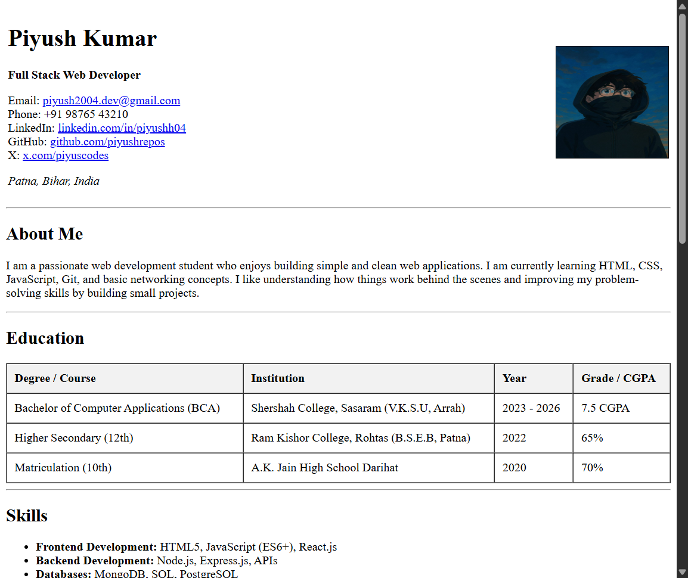
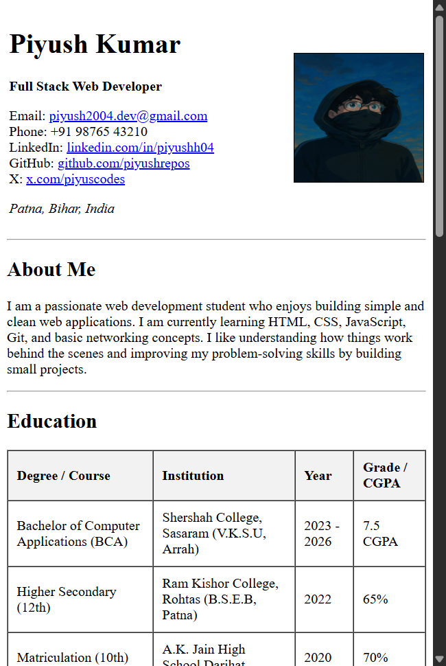

# HTML Resume Page Assignment

## Overview

This repository contains a **single-page resume website** built using purely **HTML**. As per the assignment guidelines, **NO CSS** was used for styling. The layout and visual structure rely entirely on HTML tags and attributes (e.g., tables, semantic tags, lists).

## Assignment Details

- **Course**: Web Dev Cohort 2026
- **Topic**: HTML Resume Page
- **Constraints**:
  - Single-page layout
  - Pure HTML (No CSS)
  - Must include specific sections: Header, About, Skills, Experience, Projects, Education, Contact.
  - Clean and readable structure using semantic tags.

## Project Structure

- `index.html`: The main resume file containing all the markup.
- `README.md`: Project documentation.

## Features

- **Header**: Includes name, role, contact links, and a profile image.
- **Semantic Sections**: Uses `<header>`, `<nav>`, `<main>`, `<section>`, `<article>`, `<footer>` for better document structure.
- **Tables**: Used for displaying structured data like **Education** and **Work Experience**.
- **Lists**: Used for **Skills** and **Projects** to ensure readability.
- **Attributes**: Utilizes `border`, `cellpadding`, `width`, and `align` attributes to achieve a neat layout without stylesheets.

## How to Run

1. Clone this repository (if hosted on GitHub):
   ```bash
   git clone https://github.com/PiyushRepos/html-resume.git
   ```
2. Navigate to the project directory:
   ```bash
   cd html-resume
   ```
3. Open the `index.html` file in any standard web browser (Chrome, Firefox, Edge, etc.).
   - You can simply double-click the file, or
   - Right-click > Open with > Google Chrome.

## Screenshots




---

**Author**: Piyush Kumar
**Date**: Jan, 2026
